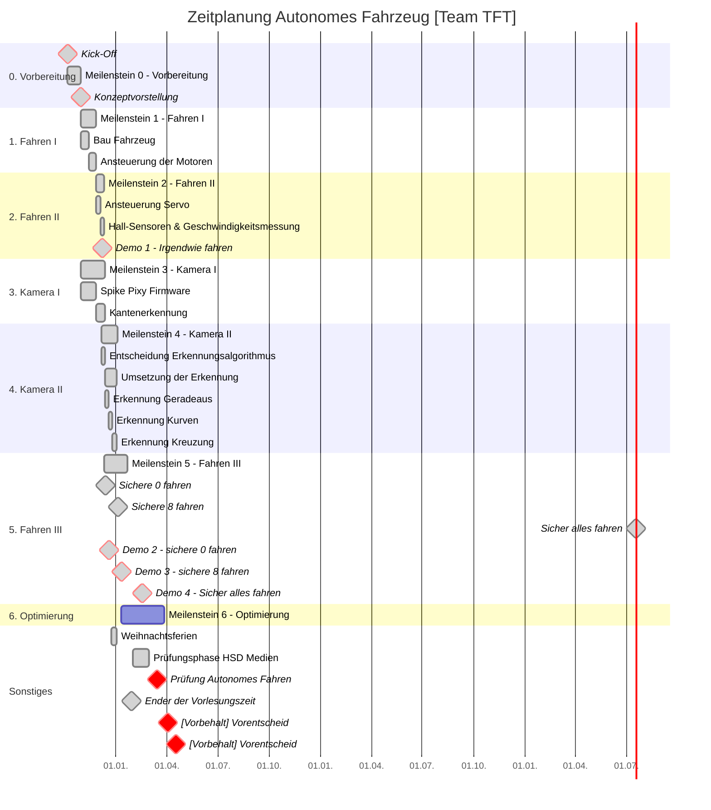

# NXPCupCar

Wir lassen Auto fahren  

## Zeitplanung

```mermaid
gantt
dateFormat DD.MM.YYYY
axisFormat  %d.%m.

title Zeitplanung Autonomes Fahrzeug [Team TFT]

%% This only works on mermaid.live:

%% tickInterval 1week
%% weekday monday
%% todayMarker off

section 0. Vorbereitung
    Kick-Off : crit, milestone, done, p0, 2023-10-06, 1d

    Meilenstein 0 - Vorbereitung : done, m0, 2023-10-06, 24d

    Konzeptvorstellung : crit, done, milestone, p1, 2023-10-30, 0d


section 1. Fahren I
    Meilenstein 1 - Fahren I : done, m1, after m0, 4w

    Bau Fahrzeug : done, a11, after m0, 2w
    Ansteuerung der Motoren : done, a12, after a11, 2w


section 2. Fahren II
    Meilenstein 2 - Fahren II : done, m2, after m1, 2w

    Ansteuerung Servo : done, a21, after m1, 1w
    Hall-Sensoren & Geschwindigkeitsmessung : done, a22, after a21, 1w

    Demo 1 - Irgendwie fahren : done, crit, milestone, p4, 2023-12-08, 0d


section 3. Kamera I
    Meilenstein 3 - Kamera I : done, m3, after m0, 43d

    Spike Pixy Firmware : done, a31, after m0, 4w
    Kantenerkennung : done, a32, after a31, 15d


section 4. Kamera II
    Meilenstein 4 - Kamera II : done, m4, 2023-12-06, 29d

    Entscheidung Erkennungsalgorithmus : done, a41, 2023-12-06, 6d

    Umsetzung der Erkennung : done, a42, after a41, 3w

    Erkennung Geradeaus : done, a42a, after a41, 1w
    Erkennung Kurven : done, a42b, after a42a, 1w
    Erkennung Kreuzung : done, a42c, after a42b, 1w


section 5. Fahren III
    Meilenstein 5 - Fahren III : done, m5, after m2, 6w

    Sichere 0 fahren : done, milestone, a52, 2023-12-13, 1d
    Sichere 8 fahren : done, milestone, a53, 2024-01-04, 1d
    Sicher alles fahren : done, milestone, a54, after a42d, 1d

    Demo 2 - sichere 0 fahren : done, crit, milestone, p5, 2023-12-19, 1d
    Demo 3 - sichere 8 fahren : done, crit, milestone, p6, 2024-01-11, 1d
    Demo 4 - Sicher alles fahren: done, crit, milestone, p7, 2024-02-16, 1d


section 6. Optimierung
    Meilenstein 6 - Optimierung : m6, 2024-01-11, 11w

    %% Erkennung Ziellinie : a42d, 2024-01-18, 1w


section Sonstiges
    Weihnachtsferien : done, p2, 2023-12-23, 11d
    Prüfungsphase HSD Medien : done, p8, 2024-01-31, 29d
    Prüfung Autonomes Fahren : crit, milestone, p9, 2024-03-15, 0d
    Ender der Vorlesungszeit : done, milestone, p3, 2024-01-28, 1d

    [Vorbehalt] Vorentscheid: crit, milestone, pc1, 2024-04-03, 0d
    [Vorbehalt] Vorentscheid: crit, milestone, pc1, 2024-04-17, 0d

```
